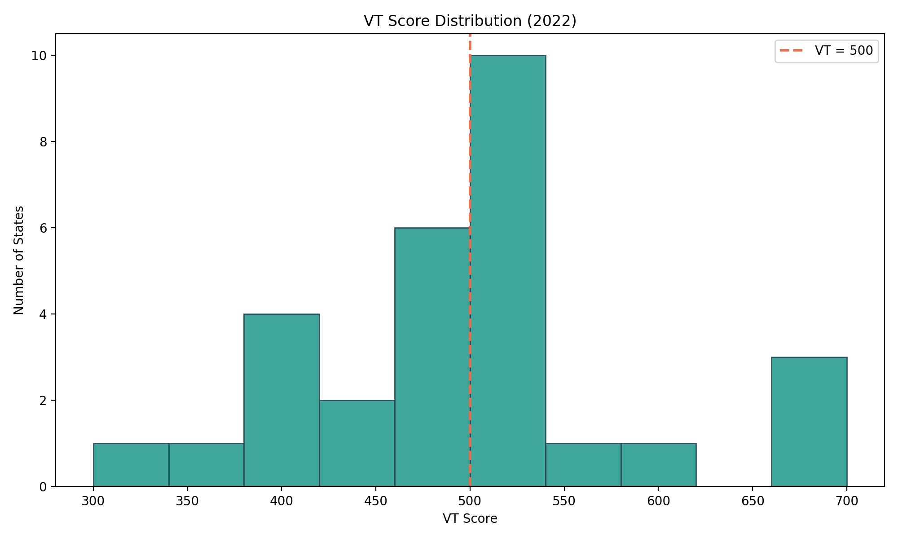
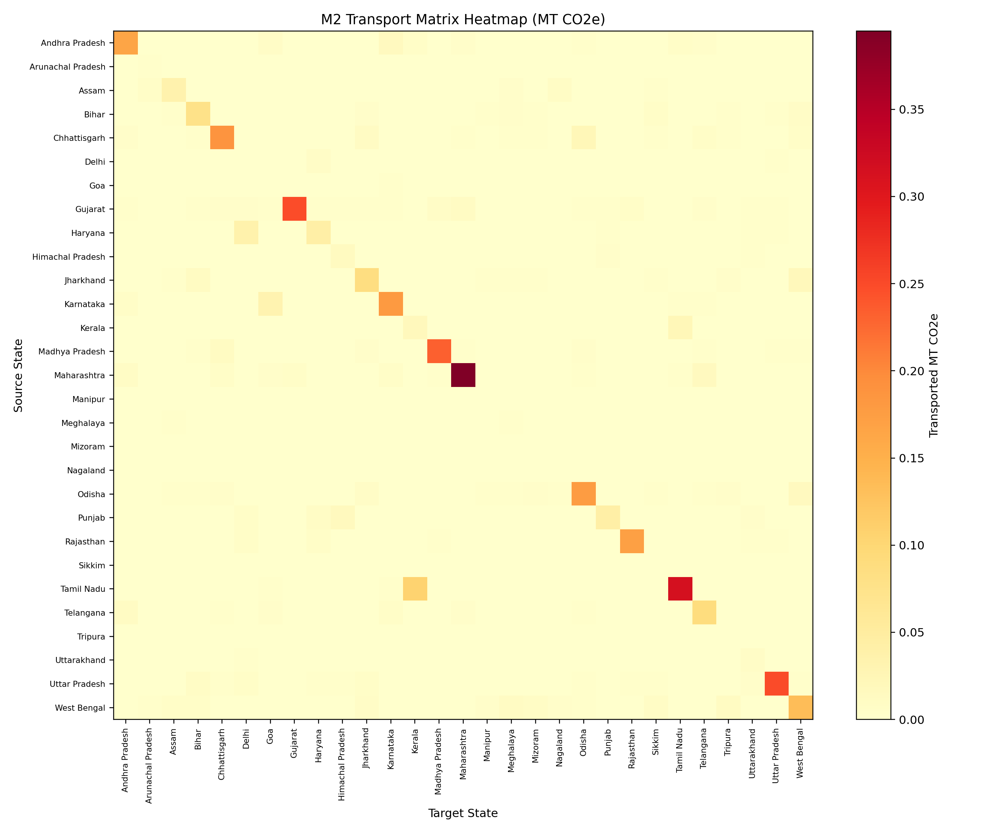
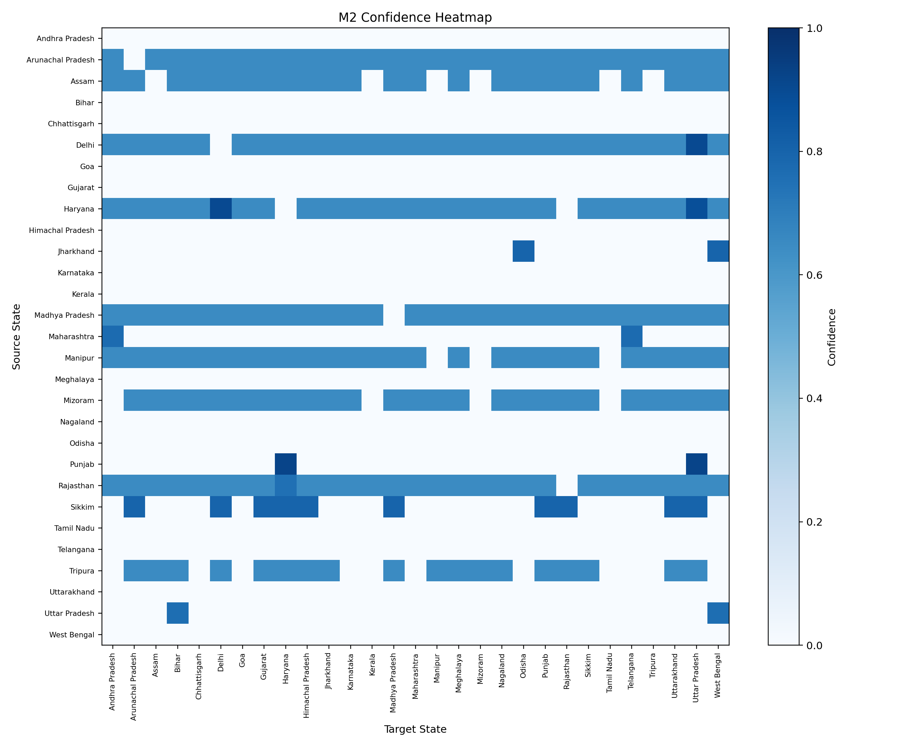
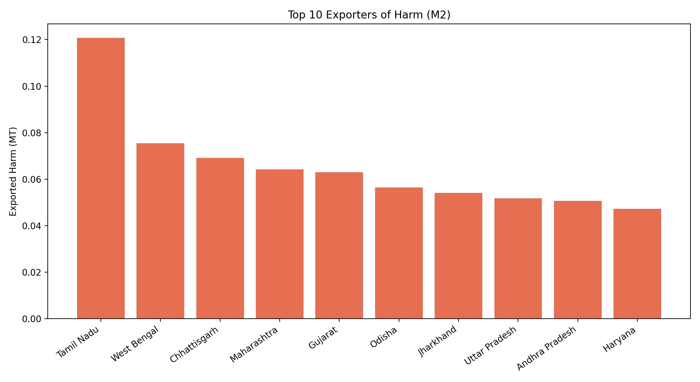
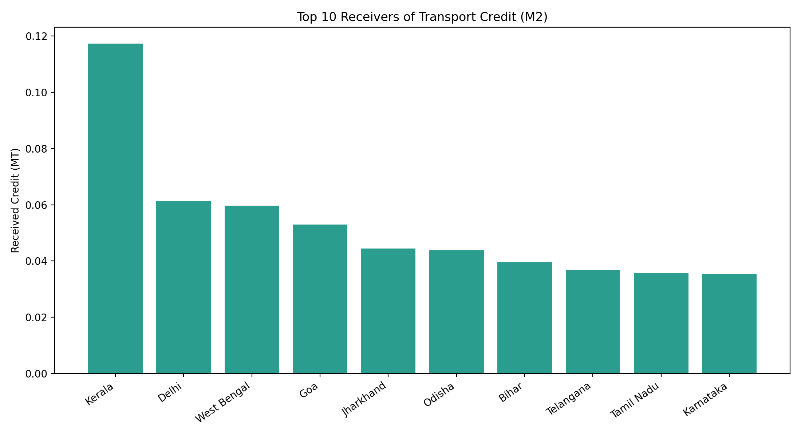
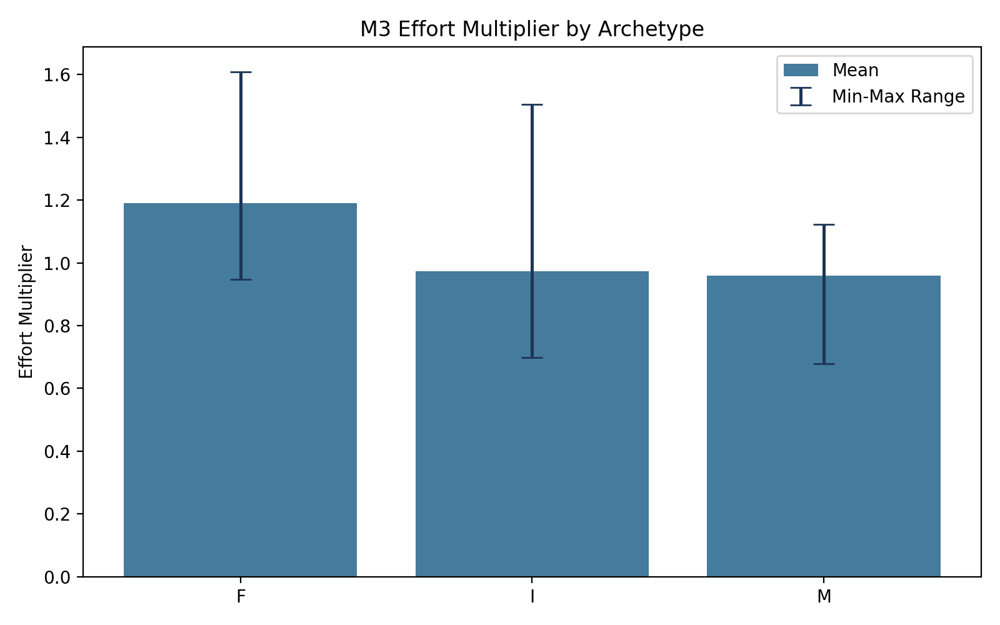

# CarbonVayu Visual Diagnostics

Generated charts for quick review of M2, M3, and VT behavior.

## Key visual findings
1. VT distribution is centered near 500 but has top-end saturation (exact 700 count: 2).
2. M2 matrix heatmap shows dominant diagonal mass with relatively small off-diagonal transport cells.
3. Confidence heatmap is sparse/highly selective; most flows have 0 confidence.
4. Top exporters and top receivers identify cross-state burden asymmetries.
5. M3 archetype chart confirms F-type states have higher average effort multipliers.

## Clipping diagnostics
- Exact 300 count: 1
- Exact 700 count: 2

## Chart files
- VT histogram: 
- M2 matrix heatmap: 
- M2 confidence heatmap: 
- Top exporters: 
- Top receivers: 
- M3 effort by archetype: 
